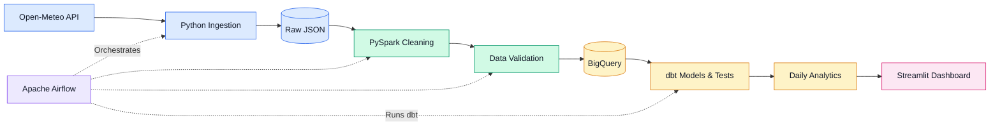

# 🌦️ Weather & Air Quality Data Pipeline


An end-to-end data engineering project that ingests hourly weather and air-quality data for **Pune** from the Open-Meteo API, cleans and validates it with **PySpark**, loads it into **Google BigQuery**, models it with **dbt**, orchestrates everything with **Apache Airflow**, and serves insights through an interactive **Streamlit** dashboard.

---

## 📑 Table of Contents

- [Architecture](#️-architecture)
- [Tech Stack](#️-tech-stack)
- [Key Features](#-key-features)
- [Pipeline Stages](#-pipeline-stages)
- [Project Structure](#-project-structure)
- [Getting Started](#-getting-started)
- [Run the Dashboard](#️-run-the-dashboard)
- [Future Improvements](#-future-improvements)
- [Data Source](#-data-source)
- [Author](#-author)

---

## 🏗️ Architecture



---

## 🛠️ Tech Stack

| Layer | Technology | Purpose |
|---|---|---|
| Ingestion | Python | API calls and pipeline logic |
| Processing | PySpark | Cleaning, deduplication, validation |
| Warehouse | Google BigQuery | Cloud data storage |
| Transformation | dbt | SQL models and data tests |
| Orchestration | Apache Airflow | Scheduling and dependency management |
| Environment | Docker | Containerized, reproducible setup |
| Visualization | Streamlit & Plotly | Interactive dashboard |

---

## 📊 Key Features

- ⏱️ **Hourly data** for weather and air quality in Pune
- 🧹 **Robust cleaning**: duplicate removal and schema validation with PySpark
- 🏛️ **BigQuery warehouse** with analytical models
- 🧪 **dbt staging and daily aggregation models**, backed by data tests
- 🔁 **Airflow DAG** that automates the full workflow end to end
- 📈 **Interactive dashboard** with KPI cards, trend charts, AQI categories, date filters, and cross-filtering

---

## 🔄 Pipeline Stages

| # | Stage | Description |
|---|---|---|
| 1 | **Ingest** | Fetch hourly weather and air-quality data from Open-Meteo and store as raw JSON |
| 2 | **Clean** | Standardize types, handle nulls, and remove duplicates using PySpark |
| 3 | **Validate** | Run quality checks before anything is loaded |
| 4 | **Load** | Write validated data to BigQuery |
| 5 | **Transform** | Build dbt staging and daily aggregate models, and run dbt tests |
| 6 | **Visualize** | Explore results in the Streamlit dashboard |

---

## 📁 Project Structure

> Adjust folder names to match your repository.

```text
.
├── airflow/          # DAGs and Airflow configuration
├── ingestion/        # Open-Meteo API scripts
├── spark/            # PySpark cleaning and validation jobs
├── dbt/              # Staging models, daily aggregates, tests
├── streamlit/
│   └── app.py        # Dashboard entry point
├── docker-compose.yml
├── requirements.txt
└── README.md
```

---

## 🚀 Getting Started

### Prerequisites

- Python 3.10+
- Docker and Docker Compose
- A Google Cloud project with BigQuery enabled
- A service account key (JSON) with BigQuery access

### Setup

```bash
# 1. Clone the repository
git clone https://github.com/ishamankar17/<your-repo-name>.git
cd <your-repo-name>

# 2. Install dependencies
pip install -r requirements.txt

# 3. Authenticate with Google Cloud
export GOOGLE_APPLICATION_CREDENTIALS="path/to/service-account.json"
```

---

## ▶️ Run the Dashboard

After configuring Google Cloud authentication and installing the dependencies:

```bash
streamlit run streamlit/app.py
```

---

## 🔮 Future Improvements

- Add more cities and a city selector in the dashboard
- Introduce incremental loading in BigQuery
- Add alerting for pipeline failures and poor AQI levels
- Deploy the dashboard to Streamlit Community Cloud or Cloud Run

---

## 🌐 Data Source

Weather and air-quality data is provided by the [Open-Meteo API](https://open-meteo.com/).

